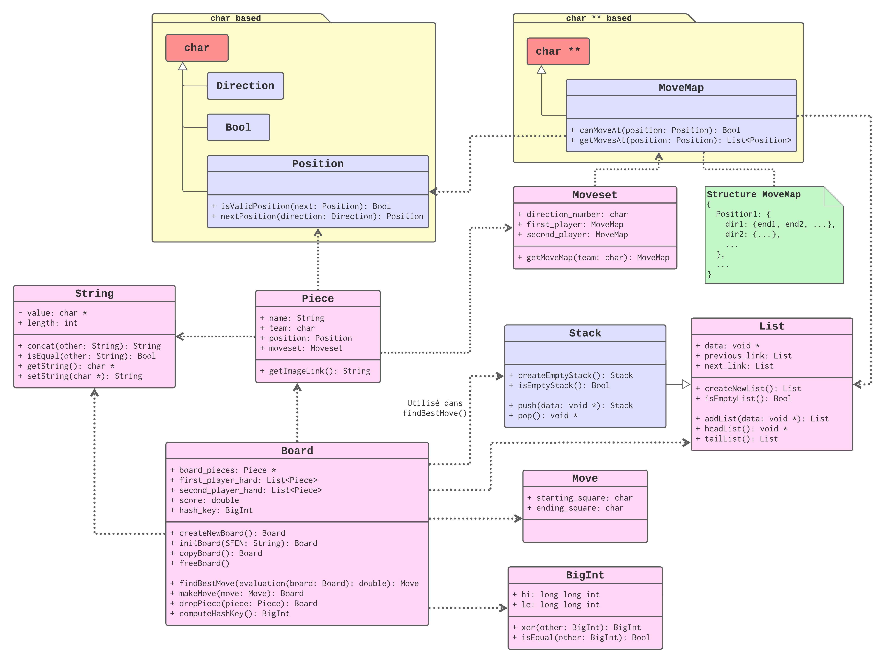

# 将棋ブレーカー  (Shōgi Breaker)

    

Shōgi Breaker (ou SB pour les intimes) est une IA qui peut jouer au Shōgi.

## Règles du jeu

Le Shōgi est un jeu d'échec japonais se jouant sur un plateau de 9x9 cases. Le but est de mettre mat le roi adverse.

## Organisation du programme (schéma UML)

